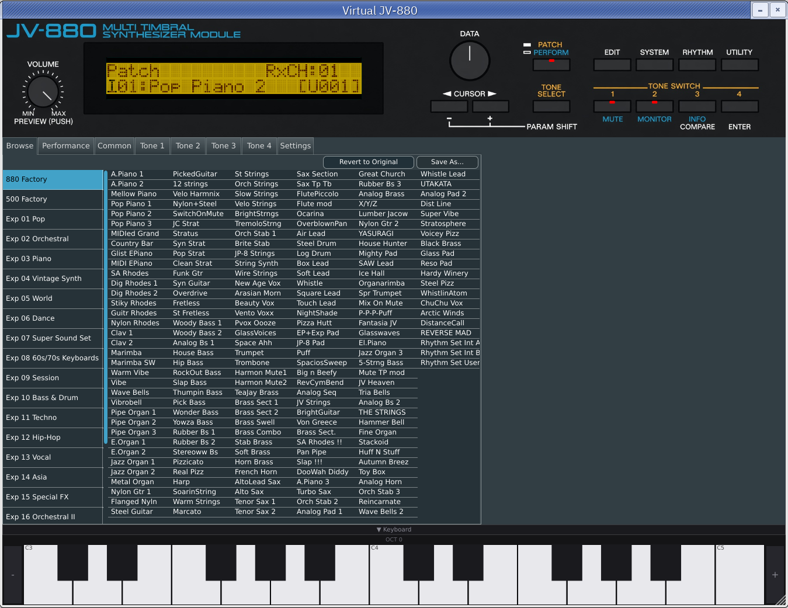

# Virtual JV-880

Emulator of a famous 1U rack unit rompler made by Roland in 1992, as a VST3 and AU plugin, as well as standalone.

Based on [NukeYKT's SC55](https://github.com/nukeykt/Nuked-SC55) and on [https://github.com/giulioz/jv880_juce](https://github.com/giulioz/jv880_juce)




You'll need ROMs to use this software. During the first run you will be able to open the destination ROM folder. Copy your ROMs there, restart the plugin, and wait for a minute for the first load to happen (waveform ROMs need to be descrambled and copied to a cache, which may take a minute). Have fun!

You can get the ROMs at: 
- [https://archive.org/download/roland-jv880-rom](https://archive.org/download/roland-jv880-rom)
- and / or [https://archive.org/details/jv880_rompack_v1](https://archive.org/details/jv880_rompack_v1)

And the official docs at:
- [https://archive.org/details/synthmanual-roland-jv-880-owners-manual](https://archive.org/details/synthmanual-roland-jv-880-owners-manual) (in English)
- [http://synthedoc.free.fr/Roland/Doc/Serie-JV/roland_jv880_fr.pdf](http://synthedoc.free.fr/Roland/Doc/Serie-JV/roland_jv880_fr.pdf) (in French)

The [DOCS.md](DOCS.md) for this emulation.


## Plugin downloads

- [https://github.com/luginf/virtual-jv-880/releases](https://github.com/luginf/virtual-jv-880/releases)


**NOTE (Windows)**: If you are having troubles with Windows 10, it's possible you need to install the [Visual C++ 2022 Redistributable](https://learn.microsoft.com/en-us/cpp/windows/latest-supported-vc-redist?view=msvc-170#latest-microsoft-visual-c-redistributable-version).

**NOTE (MacOS)**: If you are having troubles with MacOS, it's possible your operating system is blocking the plugin because it's coming from an unregister developer. You can allow this plugin by running this command on a terminal:

```sudo xattr -rd com.apple.quarantine /Users/<yourusername>/Library/Audio/Plug-Ins/Components/jv880.component```

More info on this guide: https://www.osirisguitar.com/2020/04/01/how-to-make-unsigned-vsts-work-in-macos-catalina/
